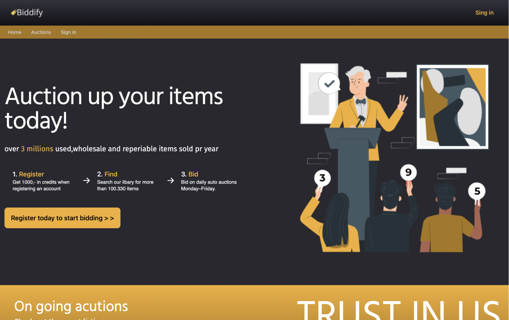

# Biddify 🛍️

Biddify is an auction website where users can add products and bid on them. The main objective of this project is to create a user-friendly platform where users can easily browse and participate in auctions. Users can also earn credits and use them to place bids on their desired products. The project aims to provide an engaging and interactive auction experience for users.

## User Stories 👥

Biddify was developed to cater to the following user stories:

- 🌐 Users can view a list of available products for auction.
- 🔍 Users can search for specific products to bid on.
- 🏷️ Users can view the details of a specific product by its ID.
- 💰 Users can earn credits by participating in auctions.
- 💸 Users can use their earned credits to place bids on products.
- 📧 Users can register an account with their email to participate in auctions.
- ✍️ Registered users can add new products for auction.
- 🔄 Registered users can update the details of their listed products.
- 🗑️ Registered users can remove their products from auction.
- 👀 Registered users can view their active bids and auction history.
- 🔐 Registered users can log in to access their account.
- 🖼️ Registered users can upload and update their profile picture.
- 🔓 Registered users can log out of their account.

## Tech Stack ⚙️

This project was developed using the following technologies:

- 📚 React for building the user interface.
- ⚡ Vite as the build tool.
- 🎨 Tailwind CSS for styling.
- 🖌️ Figma for designing the user interface.
- 📈 GitHub Projects for planning and managing tasks.
- ☁️ Netlify for hosting.

## Live Demo 🔗

You can visit the live demo of the project [here](https://biddify.netlify.app/).

## Getting Started 🚀

1. 🍴 Fork the repository.
2. 📂 Clone the forked repository to your local machine.
3. 📝 Open the project in your favorite code editor.
4. 🛠️ Run `npm install` in the project root directory to install the necessary dependencies.
5. 🏃‍♀️ Run `npm run dev` to start the development server.
6. The project should now be running on `localhost:3000` (or whichever port your environment is set up to use).

## Connect with Me 🤝
LinkedIn: [Sandra Bakken Møller Sørensen](https://www.linkedin.com/in/sandra-bakken-m%C3%B8ller-s%C3%B8rensen/)

Happy bidding! 💻

